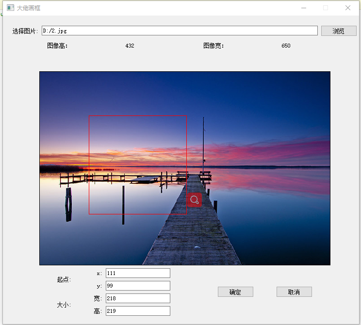

# picBOX

QT+Opencv实现对图片的ROI区域框选，
开发环境为qt5.14 opencv4.5.2，cmake，搭建可参考：[链接](https://blog.csdn.net/weixin_39752599/article/details/117351413?spm=1001.2014.3001.5501)

### 功能：

- 打开图片，获取图片的基本信息
- 用户通过截取矩形，截取ROI感兴趣区
- 后面根据需求继续添加

### 搭建步骤：

项目目录下lib/opencv_lib.zip，为opencv4.5.2的window编译好的库文件
初步实现效果：

### 感谢大佬：

1.https://github.com/huihut/OpenCV-MinGW-Build 

2.https://github.com/chengyangkj/VideoRoi
